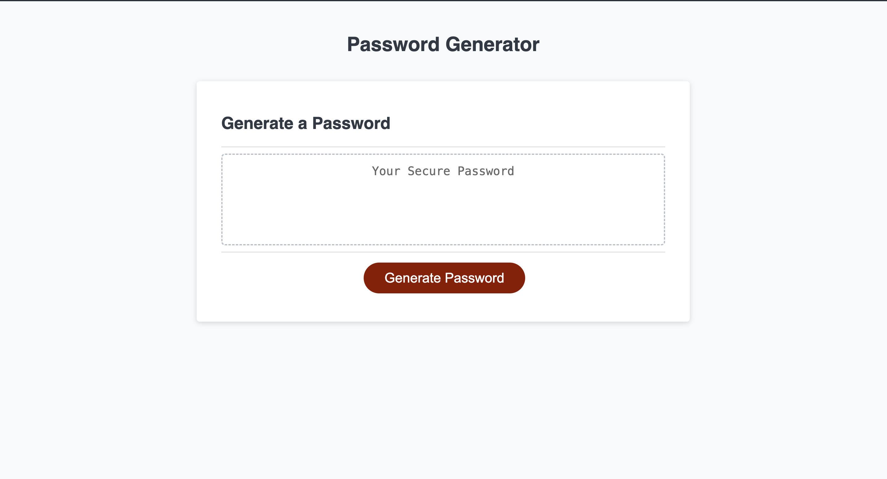
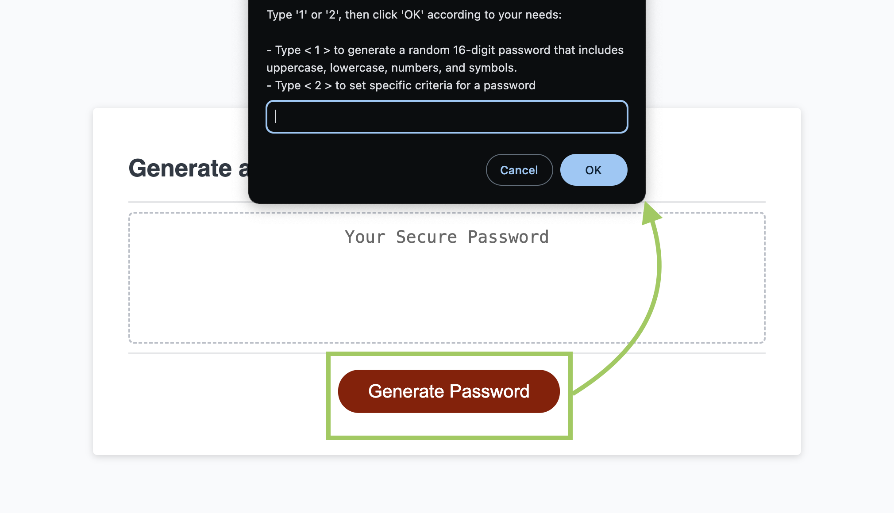
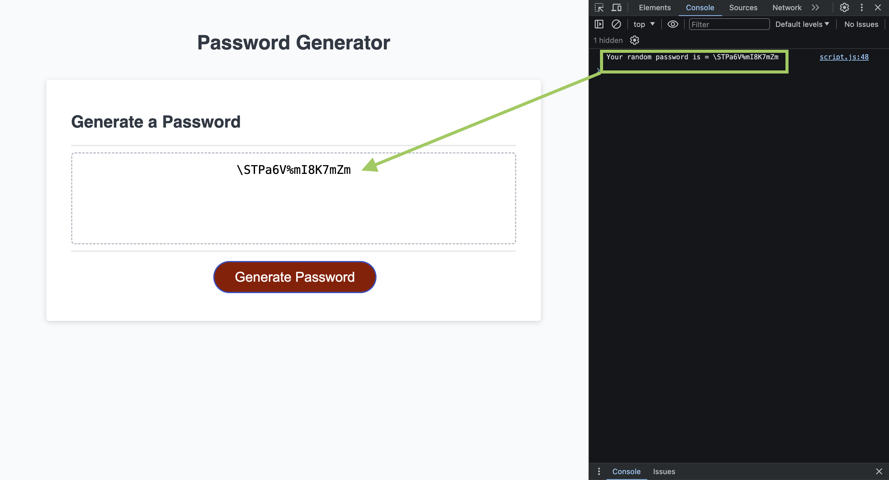
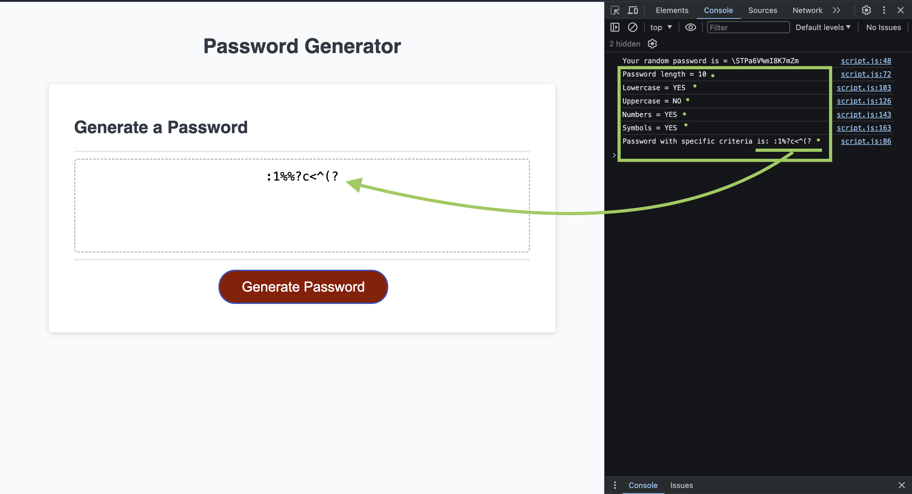

# Password Generator

## Description

This webpage generates either a random 16-character password (that includes lowercase, uppercase, numbers and symbols) OR a password based on specific criteria set by the user. Both of these scenarios require the user to input a response via prompts so they can decide what type of password best fits their needs. 

Go the `Installation` section of this README file to visit the deployed application 🚀

## Table of Contents

* [Installation](#installation)
* [Usage](#usage)
* [Credits](#credits)
* [License](#license)

## Installation

[Click here to visit the live webpage! 🗒️](https://marcusmr15.github.io/password-generator/)

## Usage

By clicking the red `Generate Password` button, two scenarios are available: 

* The user can input the number '1' to create a random 16-character password

* The user can input the number '2' to set specific criteria like the length (the user can choose between 8 to 128 characters), and wether to __include__ or __exclude__ lowercase, uppercase, numbers, and symbols

❗ These prompts also handle incorrect answers like an empty answer or when the criteria is not met.

## Credits

This webpage was created with the help of:
* The starter code from the repo [friendly-parakeet](https://github.com/coding-boot-camp/friendly-parakeet) by [Xander Rapstine](https://github.com/Xandromus).
* The `Xpert Learning Assistant `AI developed by __edX__.
* The `Chat GPT` AI developed by __Open AI__.

## License

* This repository does not have a specific license.
* This project was created by [Marcos Munoz](https://github.com/marcusmr15).

