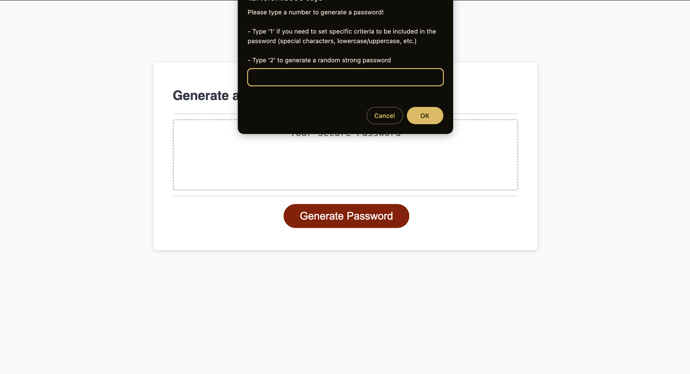

# Password Generator

## Description

This webpage intends to generate a password based on specific criteria set by the user, or by generating a random password if the user selects wants to omit selecting specific criteria.

[Click here to view the live webpage!](https://marcusmr15.github.io/password-generator/)

## Installation

N/A

## Usage

By clicking the red ‘Generate Password’ button, the user can either create a random strong password or one with specific criteria set by the user through responses in prompt messages. Here is an image of the website to better illustrate its design and functionality.

## Credits

N/A.

## License

This repository does not have a specific license.

