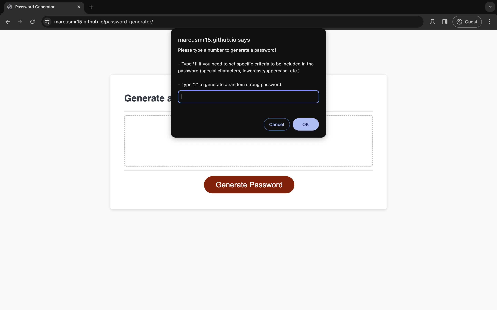

# Password Generator

## Description

This webpage intends to generate a password based on specific criteria set by the user, or by simply generating a random password if the user selects to selecting specific criteria.

[Click here to view the live webpage](https://marcusmr15.github.io/password-generator/)

## Installation

N/A

## Usage

By clicking the red ‘Generate Password’ button, the user can create either a random strong password or one with specific criteria set by the user through prompt messages. Here is an image to display the web’s functionality.

## Credits

N/A.

## License

This repository does not have a specific license.

